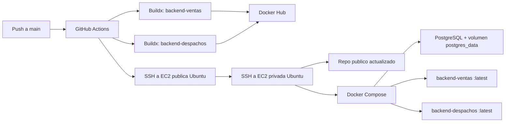

# Design: Mejorar CI/CD para despliegue en EC2 privada

## Resumen

El pipeline seguira dividido en dos jobs: `build-and-push` y `deploy`. El primer job construye y publica las imagenes `backend-ventas` y `backend-despachos` en Docker Hub con tags `latest` y `<commit-sha>`. El segundo job se conectara por SSH a una EC2 publica Ubuntu usada como bastion y, desde ahi, abrira una conexion SSH hacia una EC2 privada Ubuntu donde se ejecutara el despliegue real.

El despliegue en la EC2 privada sera idempotente: instalara herramientas faltantes, clonara el repositorio publico si no existe, actualizara el repositorio si existe, escribira `.env`, levantara PostgreSQL, descargara las imagenes `latest` y recreara solo los contenedores de backend sin eliminar el volumen de base de datos.

## Archivos que probablemente se modificaran

| Archivo | Cambio esperado |
|---|---|
| `.github/workflows/deploy.yml` | Reemplazar deploy directo a una EC2 por despliegue via bastion publico hacia EC2 privada. Actualizar secrets `EC2_*` a `PUBLIC_EC2_*` y `PRIVATE_EC2_*`. Agregar instalacion idempotente de dependencias, deteccion de `sudo`, clone/pull del repo publico y validaciones finales. |
| `init-db/01_init.sh` | Parametrizar nombres de bases con `DB_NAME_VENTAS` y `DB_NAME_DESPACHOS`, manteniendo defaults `ventas_db` y `despachos_db`. |
| `docker-compose.yml` | Mantener imagenes `:latest`, puertos actuales y volumen `postgres_data`. Solo modificar si el script de inicializacion parametrizado requiere pasar variables adicionales a PostgreSQL. |
| `.env.example` | Documentar variables necesarias para Compose local y nombres de base de datos usados por `init-db`. |
| `README.md` | Actualizar la seccion CI/CD con topologia bastion, secrets finales y flujo de despliegue. |

## Arquitectura propuesta

La EC2 publica no ejecuta contenedores. Solo recibe temporalmente la clave privada necesaria para saltar a la EC2 privada y debe eliminarla al terminar, incluso si el despliegue falla. La EC2 privada es el unico host productivo.

## Flujo de datos y despliegue

1. GitHub Actions recibe push a `main`.
2. `build-and-push` publica:
   - `${DOCKERHUB_USERNAME}/backend-ventas:latest`
   - `${DOCKERHUB_USERNAME}/backend-ventas:${github.sha}`
   - `${DOCKERHUB_USERNAME}/backend-despachos:latest`
   - `${DOCKERHUB_USERNAME}/backend-despachos:${github.sha}`
3. `deploy` abre SSH a `PUBLIC_EC2_HOST` con `PUBLIC_EC2_USER` y `PUBLIC_EC2_SSH_KEY`.
4. En la EC2 publica se crea un archivo temporal `private_ec2_key.pem` con `PRIVATE_EC2_SSH_KEY` y permisos `600`.
5. Desde la EC2 publica se ejecuta un script remoto en `PRIVATE_EC2_USER@PRIVATE_EC2_HOST`.
6. En la EC2 privada:
   - Se define `SUDO=""` si Docker funciona sin privilegios, o `SUDO="sudo"` si requiere privilegios.
   - Se instala `git`, Docker Engine y Docker Compose si faltan.
   - Se clona `REPO_URL` en `/home/<PRIVATE_EC2_USER>/devops_backend` si no existe.
   - Se ejecuta `git fetch`, `git checkout main` y `git pull --ff-only origin main` si ya existe.
   - Se escribe `.env` con secrets productivos.
   - Se ejecuta `docker compose up -d postgres`.
   - Se ejecuta `docker compose pull backend-ventas backend-despachos`.
   - Se ejecuta `docker compose up -d --no-deps --force-recreate backend-ventas backend-despachos`.
   - Se ejecutan validaciones con `docker compose ps` y checks HTTP locales contra `8082` y `8081`.
7. En la EC2 publica se elimina la clave temporal.

## Cambios en base de datos

No se cambia el motor ni el volumen. PostgreSQL sigue usando `postgres:16-alpine` y `postgres_data`.

El script `init-db/01_init.sh` debe usar los nombres recibidos por entorno:

- `DB_NAME_VENTAS`, default `ventas_db`.
- `DB_NAME_DESPACHOS`, default `despachos_db`.

Esto evita que el Compose apunte a bases definidas por secrets que nunca fueron creadas. Como los scripts de `docker-entrypoint-initdb.d` solo corren cuando el volumen esta vacio, el deploy no debe depender de este mecanismo para migraciones posteriores.

## Dependencias nuevas

No se agregan dependencias al repositorio. El pipeline puede instalar herramientas en la EC2 privada si faltan:

- `git`
- Docker Engine
- Docker Compose plugin

La instalacion debe usar comandos compatibles con Ubuntu y ejecutarse solo cuando la herramienta no exista.

## Secrets requeridos

| Secret | Uso |
|---|---|
| `DOCKERHUB_USERNAME` | Login y nombre de imagenes Docker Hub. |
| `DOCKERHUB_TOKEN` | Login a Docker Hub. |
| `PUBLIC_EC2_HOST` | IP publica o DNS del bastion. |
| `PUBLIC_EC2_USER` | Usuario SSH de la EC2 publica. |
| `PUBLIC_EC2_SSH_KEY` | Clave privada para conectar GitHub Actions con la EC2 publica. |
| `PRIVATE_EC2_HOST` | IP privada o DNS privado de la EC2 privada. |
| `PRIVATE_EC2_USER` | Usuario SSH de la EC2 privada. |
| `PRIVATE_EC2_SSH_KEY` | Clave privada para conectar desde la EC2 publica a la EC2 privada. |
| `REPO_URL` | URL publica del repositorio. |
| `POSTGRES_USER` | Usuario PostgreSQL. |
| `POSTGRES_PASSWORD` | Password PostgreSQL. |
| `DB_NAME_VENTAS` | Base de datos de ventas. |
| `DB_NAME_DESPACHOS` | Base de datos de despachos. |

## Manejo de errores

- Si falla el build o push de una imagen, el job `deploy` no corre por `needs: build-and-push`.
- El script remoto debe usar `set -euo pipefail` para cortar ante errores.
- La clave privada temporal en la EC2 publica debe eliminarse con `trap` al salir.
- Si Docker no responde sin `sudo`, el script debe reintentar con `sudo`.
- Si `git pull --ff-only` falla por cambios locales en la EC2 privada, el deploy debe fallar para evitar pisar cambios manuales.
- Si los checks HTTP fallan, el deploy debe fallar y mostrar `docker compose ps` y logs recientes de los backends.

## Estrategia de testing

- Validar sintaxis del workflow con una revision YAML local o `actionlint` si ya esta disponible.
- Validar Compose con `docker compose config`.
- Validar sintaxis shell de scripts embebidos extrayendolos o revisandolos con `bash -n` cuando sea practico.
- Validar `init-db/01_init.sh` con `bash -n`.
- Ejecutar un deploy real desde `main` en GitHub Actions y confirmar:
  - Imagenes publicadas en Docker Hub con `latest` y `<commit-sha>`.
  - Conexion GitHub Actions -> EC2 publica.
  - Conexion EC2 publica -> EC2 privada.
  - Herramientas instaladas o detectadas en EC2 privada.
  - `docker compose ps` muestra `postgres_db`, `backend_ventas` y `backend_despachos` corriendo.
  - Endpoints responden en `8082` y `8081`.
  - El volumen `postgres_data` persiste entre dos despliegues.

## Riesgos y mitigaciones

| Riesgo | Mitigacion |
|---|---|
| La clave privada de la EC2 privada queda en el bastion. | Crear archivo temporal con permisos `600` y eliminarlo con `trap`. |
| La EC2 privada no tiene salida a internet. | Fallar temprano al intentar instalar paquetes, clonar repo o hacer `docker compose pull`. |
| El usuario requiere `sudo` para Docker. | Detectar y usar prefijo `sudo` en comandos Docker y de instalacion. |
| `git pull --ff-only` falla por cambios manuales. | Fallar sin resetear para no destruir cambios no controlados. |
| Bases definidas por secrets no existen. | Parametrizar `init-db/01_init.sh` y documentar que volumenes existentes requieren creacion manual/migracion. |
| Rollback con `latest` no es directo. | Mantener tags `<commit-sha>` publicados para poder retaguear una version previa si hace falta. |

## Decisiones de diseno

- Usar `latest` en `docker-compose.yml` para respetar el requisito de despliegue operativo.
- Publicar tambien `<commit-sha>` para trazabilidad.
- No usar `docker compose down` ni `down -v`.
- No hacer `git reset --hard` en la EC2 privada.
- No exponer secretos en comandos con `echo` visible; escribir archivos sensibles dentro de heredocs controlados por GitHub Actions.
- Mantener el puerto `5432` publicado en Compose porque el spec indica que el Security Group bloquea acceso externo directo.
